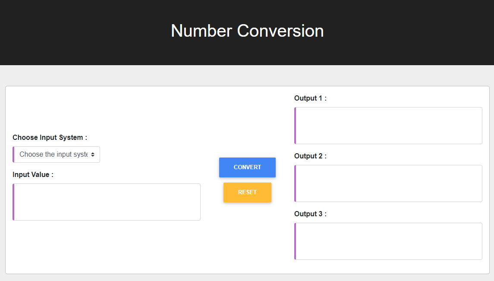

## Number Conversion
---
Binary -> Decimal/Octal/Hexadecimal
Decimal -> Binary/Octal/Hexadecimal
Octal -> Binary/Decimal/Hexadecimal
Hexadecimal -> Binary/Decimal/Octal

By: [Shree Krishna Lamichhane](https://github.com/shreekrishnalamichhane)

Demo:
